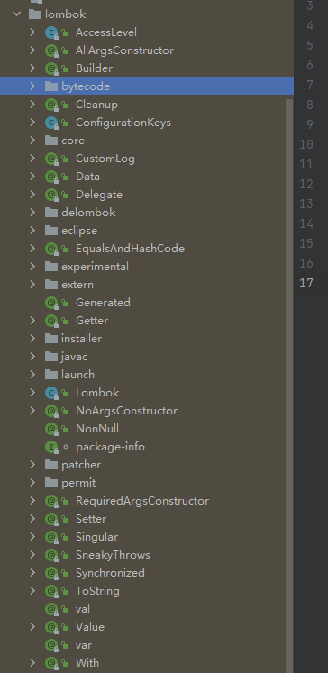
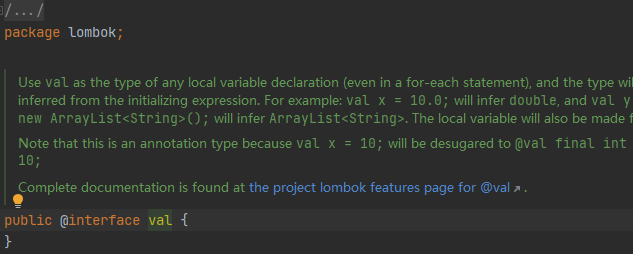
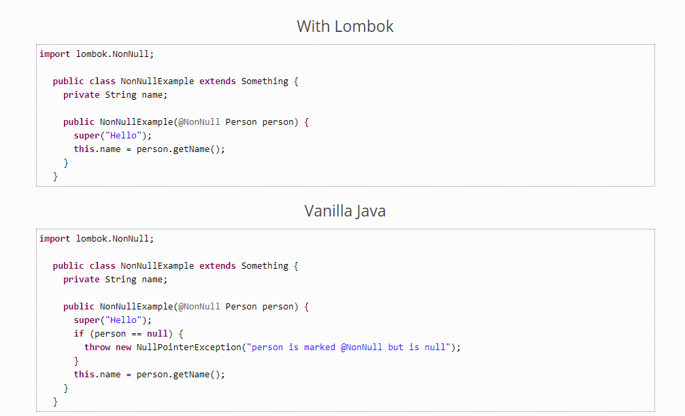

# lombok详细文档
## 1.原理
刚接触lombok的时候，颠覆了我的认知，因为他违背了java的语法，因为java的语法就不存在说加一个注解就会有get，set方法，编译器没有这个支持。

仔细研究后发现，lombok实际上是一个插件，并不是运行在java程序中的，可以理解成他是编译器的扩展，至于我们用到的一些注解，只是给lombok
这个编译器扩展去识别的，并不会带到源代码里，更不会有性能问题。

```xml
<dependencies>
    <dependency>
        <groupId>org.projectlombok</groupId>
        <artifactId>lombok</artifactId>
        <version>1.18.16</version>
        <scope>provided</scope>
    </dependency>
</dependencies>
```

## 2.引入
在上述讲解中已经给出，在maven项目里依赖此g-a-v坐标即可使用，如果希望开发工具能识别lombok重新定义的语法，相应的开发工具也需要安装插件
否则不认识这样的语法规则

idea直接在插件市场搜索安装即可，其他的开发工具lombok有所支持，但是我不支持使用除idea之外的任何ide，所以不做任何介绍

## 3.使用
### 1.val
val在lombok依赖里是一个注解的方式存在


之前也有所提及，他并不属于编译器所管束，所以他可以自己定义自己的语法，所以此注解，并不是我们传统的@加注解名称的方式使用
他的作用是：使用val任何局部变量声明的类型（甚至在换每个语句），和类型将从初始化表达来推断。例如：val x = 10.0;将推断double，val y = new ArrayList<String>();并将推断ArrayList<String>。局部变量也将成为最终变量。

直接来看案例：

原来的写法：
```java
String str1 = "123";
```
使用val：
```java
val str1 = "123";
```
来看一下编译后的class文件,再反编译回来的结果：
原来的写法：
```java
String str1 = "123";
```
使用val：
```java
String str1 = "123";
```
可以发现实际上会在编译期间将val编译回对应的类型，推断的依据是=号后的值、表达式整体表示的值、方法返回值的类型来进行推断
值得注意的是，他只会如实的对类型推断，并不会帮忙推断出是否有父类或者接口之类的，比如：
```java
//编译前
val list = new ArrayList<>();
System.out.println(list);
//编译后
ArrayList<Object> list = new ArrayList();
System.out.println(list);
```
并没有推断成我们常写的形式：List<Object> list = new ArrayList<>();因为他如果推断成List的话，
则后面如果使用了ArrayList特有的方法则出现了错乱，是一种比较保守的推断方式
### 2.var
他和val功能相似，是鉴于JEP 286建立的，在jdk10官方已加入该关键字，可以在jdk10之前版本用lombok的var提前体验

### 3.@NonNull
在源代码中是以注解的形式存在，作用是用来判断null值
```java
@Target({ElementType.FIELD, ElementType.METHOD, ElementType.PARAMETER, ElementType.LOCAL_VARIABLE, ElementType.TYPE_USE})
@Retention(RetentionPolicy.CLASS)
@Documented
public @interface NonNull {
}
```
从源代码看来，貌似可以使用在类的属性上，方法上，方法的参数上，局部变量上，任何类型上，经过实测，貌似只有在方法参数上有作用，官网也只给出了方法参数上的demo

意思就是当你在方法的参数上标注了该注解，会在该方法前面多编译出一些null的判断，如果是null则直接抛异常
### 4.@Cleanup
在java中继承了Closeable接口的类有很多，他们一般都是需要释放资源的，这很麻烦，都需要我们手动调用，虽然java7引入了try-with-resources，但他只支持Closeable接口
或者AutoCloseable接口
用lombok的@Cleanup则很容易做到释放资源，先看下该注解的源代码
```java
@Target(ElementType.LOCAL_VARIABLE)
@Retention(RetentionPolicy.SOURCE)
public @interface Cleanup {
	String value() default "close";
}
```
可以看出，该注解只能使用在局部变量上，他的作用大致是，在变量前声明该注解，随后的代码会被包裹在try代码块里，会在finally代码块里调用该注解
的value值，默认是close，也可以指定自己的方法，在调用前会判断非null，他的判断非null很奇特，可以观赏一下
```java
public class App {

    public static void main(String[] args) {
        @Cleanup("close1") A a = new A();
        System.out.println(a);
    }
}

class A {
    public void close1(){
        System.out.println("调用了释放资源");
    }
}
//执行结果
com.fenqing168.lombok.val.A@1b6d3586 
调用了释放资源
```
可以看到我的代码中并没有调用close1方法，然仍然有打印，说明lombok帮我们编译出了一些新代码，来看看
```java
public static void main(String[] args) {
    A a = new A();
    
    try {
        System.out.println(a);
    } finally {
        if (Collections.singletonList(a).get(0) != null) {
            a.close1();
        }
    
    }

}
```
他先将a放到了一个不可变list里，然后再get出来判断null，暂时没明白为什么这么做,明明可以直接a != null
### 5.@Getter 和 @Setter
应该是使用最多的两个注解，他可以根据属性自动生成get/set方法，看一眼源代码
```java
@Target({ElementType.FIELD, ElementType.TYPE})
@Retention(RetentionPolicy.SOURCE)
public @interface Setter {
	lombok.AccessLevel value() default lombok.AccessLevel.PUBLIC;
	
	AnyAnnotation[] onMethod() default {};
	
	AnyAnnotation[] onParam() default {};
	
	@Deprecated
	@Retention(RetentionPolicy.SOURCE)
	@Target({})
	@interface AnyAnnotation {}
}

@Target({ElementType.FIELD, ElementType.TYPE})
@Retention(RetentionPolicy.SOURCE)
public @interface Getter {
    lombok.AccessLevel value() default lombok.AccessLevel.PUBLIC;

    AnyAnnotation[] onMethod() default {};

    boolean lazy() default false;

    @Deprecated
    @Retention(RetentionPolicy.SOURCE)
    @Target({})
    @interface AnyAnnotation {}
}
```
1.可以看到他们都是可以在类上或者属性上使用，先看一下他们最简单是使用方法
```java
//使用在类上
@Setter
@Getter
class A {
    private Integer id;
}
//编辑后
class A {
    private Integer id;

    A() {
    }

    public void setId(Integer id) {
        this.id = id;
    }

    public Integer getId() {
        return this.id;
    }
}
```
使用在类会将类里的所有属性都生成get/set方法，如果使用单个属性上，则可以精确的控制某个属性生成get/set方法
2.注解有许多参数，value则是生成出的方法属于什么作用于，默认是public，对应的作用于在lombok.AccessLevel枚举里都有
```java
public enum AccessLevel {
	PUBLIC, MODULE, PROTECTED, PACKAGE, PRIVATE,
	/** Represents not generating anything or the complete lack of a method. */
	NONE;
}
```
onMethod参数的类型是比较特殊的一个注解类型AnyAnnotation，这个类型在lombok的其他注解里面也存在，是lombok自己定义的语法，书写格式也不一样
他的值应该为注解的集合
```java
//在jdk7上使用 onMethod=@__({@AnnotationsGoHere}指定AnyAnnotation
//在jdk8上使用 onMethod_={@AnnotationsGohere}指定AnyAnnotation
```
onMethod的作用是，在生成的方法上加上指定的注解，比如：
```java
@Setter(onMethod_ = @Interface)
@Getter(onMethod_ = @Interface1)
class A {
    private Integer id;
}
//编译后
class A {
    private Integer id;

    A() {
    }

    @Interface
    public void setId(Integer id) {
        this.id = id;
    }

    @Interface1
    public Integer getId() {
        return this.id;
    }
}
```
由于get方法不存在参数，所以没有onParam属性，同样的道理，他是在参数前加上某些注解，
```java
@Setter(onMethod_ = @Interface, onParam_ = @Interface)
@Getter(onMethod_ = @Interface1)
class A {
    private Integer id;
}
//编译后
class A {
    private Integer id;

    A() {
    }

    @Interface
    public void setId(@Interface Integer id) {
        this.id = id;
    }

    @Interface1
    public Integer getId() {
        return this.id;
    }
}
```
getter里的lazy参数，这个参数比较难理解，当类的属性有初始值，并且创建比较耗时，则创建这个类的实例的时候耗时可能会比较长，还有可能会占用较大的内存
如果我们只希望在第一次用到的时候才创建，那这个操作可能会出现并发，多个线程同时使用的话，就会出现可能会创建两次或者更多，则这里还需要做线程的控制
然而使用lazy=true，他会将修饰的字段隐藏掉，并且使用一个原子缓存代替,在get的时候会进行双重检验来创建新对象
```java
class A {
    @Getter(lazy = true)
    private final Integer id = 1;
}
//编译后
class A {
    private final AtomicReference<Object> id = new AtomicReference();

    A() {
    }

    public Integer getId() {
        Object value = this.id.get();
        if (value == null) {
            synchronized(this.id) {
                value = this.id.get();
                if (value == null) {
                    Integer actualValue = 1;
                    value = actualValue == null ? this.id : actualValue;
                    this.id.set(value);
                }
            }
        }

        return (Integer)((Integer)(value == this.id ? null : value));
    }
}
```
### 5.@ToString
在java程序中，经常会有需要重写toString方法输出对象里属性的内容，如果属性有改动，则需要改动toString里的代码。lombok深知用户的痛点
提供了@ToString注解，先看一下源代码
```java
@Target(ElementType.TYPE)
@Retention(RetentionPolicy.SOURCE)
public @interface ToString {
	boolean includeFieldNames() default true;
	
	String[] exclude() default {};
	
	String[] of() default {};
	
	boolean callSuper() default false;
	
	boolean doNotUseGetters() default false;
	
	boolean onlyExplicitlyIncluded() default false;
	
	@Target(ElementType.FIELD)
	@Retention(RetentionPolicy.SOURCE)
	public @interface Exclude {}
	
	@Target({ElementType.FIELD, ElementType.METHOD})
	@Retention(RetentionPolicy.SOURCE)
	public @interface Include {
		
		int rank() default 0;
		
		String name() default "";
	}
}
```
首先可以看出该注解只能用在类上，看看效果
```java
// 不用@ToString
class A {
    private Integer id = 1;
}
public static void main(String[] args) {
    A a = new A();
    System.out.println(a);
}
//执行结果
com.fenqing168.lombok.val.A@1b6d3586
```
```java
// 使用@ToString
@ToString
class A {
    private Integer id = 1;
}
public static void main(String[] args) {
    A a = new A();
    System.out.println(a);
}
//执行结果
A(id=1)
```
首先要知道System.out.println方法在底层会调用对象的toString方法
```java
public void println(Object x) {
    String s = String.valueOf(x);
    synchronized (this) {
        print(s);
        newLine();
    }
}
public static String valueOf(Object obj) {
    return (obj == null) ? "null" : obj.toString();
}
```
而对象的toString都是继承于Object类
```java
public String toString() {
    return getClass().getName() + "@" + Integer.toHexString(hashCode());
}
```
所以在重写toString方法的情况下，就是上述第一种结果，类名加hashcode，希望toString为自定义的结果就需要重写
而@ToString注解就是帮忙重写toString,将所有字段拼接成字符串,反编译结果
```java
class A {
    private Integer id = 1;

    A() {
    }

    public String toString() {
        return "A(id=" + this.id + ")";
    }
}
```
注解中还有许多参数

| 属性                  | 描述                                                                       |
| -------------------- | -------------------------------------------------------------------------- |
| includeFieldNames     | 该属性设置为 false 表示输出没有属性名和等号，只有属性值，多个属性值用逗号隔开。    |
| exclude               | 该属性中列出的字段都不会在出现在生成的 toString 方法中，与 of 属性互斥。         |
| of                    | 该属性中列出的字段是要打印的字段，与 exclude 属性互斥。                         |
| callSuper             | 该属性设置为 true，表示输出中会包含父类的 toString 方法的输出结果，默认为 false。 |
| doNotUseGetters       | 通常都是通过字段的 getter 方法获取字段值，如果没有 getter 方法，才在通过直接访问字段来获取值。该属性设置为 true，表示输出的字段值不通过 getter 方法获取，而是直接访问字段，默认为 false。 |
| onlyExplicitlyIncluded | 该属性设置为 true，不输出任何字段信息，只输出了构造方法的名字，默认为 false。 |
### 6.@EqualsAndHashCode
```java
@Target(ElementType.TYPE)
@Retention(RetentionPolicy.SOURCE)
public @interface EqualsAndHashCode {
	String[] exclude() default {};
	
	String[] of() default {};
	
	boolean callSuper() default false;
	
	boolean doNotUseGetters() default false;

	CacheStrategy cacheStrategy() default CacheStrategy.NEVER;
	
	AnyAnnotation[] onParam() default {};
	
	@Deprecated
	@Retention(RetentionPolicy.SOURCE)
	@Target({})
	@interface AnyAnnotation {}
	
	boolean onlyExplicitlyIncluded() default false;
	
	@Target(ElementType.FIELD)
	@Retention(RetentionPolicy.SOURCE)
	public @interface Exclude {}
	
	@Target({ElementType.FIELD, ElementType.METHOD})
	@Retention(RetentionPolicy.SOURCE)
	public @interface Include {
		String replaces() default "";
		int rank() default 0;
	}

	public enum CacheStrategy {
		NEVER,
		LAZY
	}
}
```
从源代码中看出，注解只能用在 ElementType.TYPE， 也就是类上
他的作用就是会帮助生成出重写equals和hashcode方法的代码
equals和hashcode默认会结合类的属性来实现
1. 可通过参数exclude排除一些属性
2. 可通过参数of指定仅使用哪些属性
3. callSuper可以指定是否结合父类的equals和hashcode的结果作为实现的一部分，默认为false
4. doNotUseGetters在生成代码的时候，如果需要用到属性，而正好有get方法，
   则默认调用get方法，doNotUseGetters设置为true，则会直接引用属性，不会调用get方法
5. cacheStrategy是一个枚举类型，作用为是否缓存hashcode的结果，默认为不缓存CacheStrategy.LAZY则可以设置为缓存，
   如果字段会发生改变，则千万不要使用这个
6. onParam 与上述某些注解一样，在生成的方法上添加某些注解
7. onlyExplicitlyIncluded，设置不自动引用属性来实现
8. Exclude子注解，用在属性上，用于排除字段参与到方法的实现,一般在onlyExplicitlyIncluded=false的时候使用
9. Include子注解，用在属性上，用于加入字段参与到方法的实现,一般在onlyExplicitlyIncluded=true的时候使用